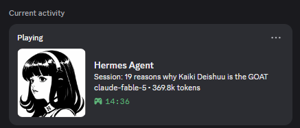

# Hermes Agent Discord Presence

[](https://github.com/DarRahman/hermes-discord-presence/actions/workflows/validate.yml)
[](plugin.yaml)
[](https://www.python.org/)
[](LICENSE)

Native Discord Rich Presence (RPC) integration for Hermes Agent. Displays active workspace session titles, LLM model names, live token consumption, elapsed time, and real-time execution states directly on your Discord profile.

<p align="center">
  
</p>

---

## Features

- **In-Process Native Execution**: Runs directly inside the Hermes Agent process using lifecycle hooks. No external background daemons or separate system services.
- **Zero Setup**: Uses a pre-configured Discord Application ID (`1530932637546451074`) with default brand assets. Works out of the box.
- **Live Status & Activity**: Real-time activity tags (`[Thinking]`, `[Running <tool>]`, `[Processing]`).
- **Session & Token Tracking**: Reads session titles, active LLM model names, and total token usage from local Hermes SQLite state storage (`state.db`).
- **Clean Session Lifecycle**: Connects on launch and disconnects cleanly when Hermes shuts down.

---

## Architecture & Flow

```
Hermes Agent Process
  │
  ├──► Lifecycle Hooks (pre_llm_call, pre_tool_call, post_tool_call, on_session_end)
  │      └──► Updates in-memory status state
  │
  ├──► SQLite Reader (file:state.db?mode=ro)
  │      └──► Queries latest session title, active model, and token count
  │
  └──► Background Sync Thread (pypresence IPC)
         └──► Updates Discord Desktop Client (Unix Domain Socket / Windows Named Pipe)
```

### Path Resolution
The plugin automatically locates Hermes database storage cross-platform:
- Windows: `%LOCALAPPDATA%\hermes\state.db`
- Linux/macOS: `~/.hermes/state.db` or `~/.config/hermes/state.db`

---

## Requirements

- Discord Desktop client running locally.
- Hermes Agent installed (CLI or Desktop GUI).
- Python 3.10+ with `pypresence` and `pyyaml`.

---

## Privacy & Data Transparency

This plugin broadcasts high-level activity to your personal Discord profile via local IPC:
- **Active Model**: e.g., `claude-fable-5`.
- **Live State**: e.g., `Active`, `Thinking...`, `Running tool: bash`.
- **Token Counts & Duration**: Formatted token counts and session elapsed time.
- **Local Only**: All data is read locally from `state.db` on your machine and sent directly to your local Discord desktop client. No external servers or third-party telemetry are involved.
- **Opt-Out / Disable**: To disable status broadcasting at any time, run `hermes plugins disable hermes-discord-rpc` or remove it from `plugins.enabled` in `config.yaml`.

---

## Installation

### 1. Install Dependencies

Install required Python packages:

```bash
pip install pypresence pyyaml
```

### 2. Install Plugin via Hermes CLI

Install directly from the GitHub repository:

```bash
hermes plugins install DarRahman/hermes-discord-presence
```

### 3. Enable Plugin

Enable the plugin via Hermes CLI:

```bash
hermes plugins enable hermes-discord-rpc
```

Or add `hermes-discord-rpc` to `plugins.enabled` in `%LOCALAPPDATA%\hermes\config.yaml` (`~/.hermes/config.yaml` on Linux/macOS):

```yaml
plugins:
  enabled:
    - hermes-discord-rpc
```

Restart Hermes Agent to apply changes.

---

## Custom Discord Application (Optional)

To use your own Discord Application ID and art assets, configure `config.yaml`:

```yaml
discord_client_id: "YOUR_DISCORD_CLIENT_ID"
update_interval: 3.0
presence:
  large_image: "your_asset_key"
  large_text: "Hermes Agent"
```

---

## Development & Verification

Run contract validation using Hermes plugin doctor:

```bash
hermes plugins doctor .
```

---

## Contributing

Contributions are welcome. Please submit issues or pull requests:

1. Fork the repository.
2. Create your feature branch (`git checkout -b feature/amazing-feature`).
3. Validate plugin integrity (`hermes plugins doctor .`).
4. Commit your changes (`git commit -m 'feat: add amazing feature'`).
5. Push to the branch (`git push origin feature/amazing-feature`).
6. Open a Pull Request.

---

## Authors & Contributors

- **Badar Rahman** ([@DarRahman](https://github.com/DarRahman))
- **Hari** ([@Mr-Neutr0n](https://github.com/Mr-Neutr0n))

---

## License

This project is licensed under the [MIT License](LICENSE).
