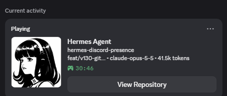

# Hermes Agent Discord Presence

[](https://github.com/DarRahman/hermes-discord-presence/actions/workflows/validate.yml)
[](https://hermes-agent.nousresearch.com/docs/plugins/hermes-discord-rpc)
[](plugin.yaml)
[](https://www.python.org/)
[](LICENSE)

Native Discord Rich Presence (RPC) integration for Hermes Agent. Displays active workspace session titles, LLM model names, live token consumption, reasoning tokens, elapsed time, and real-time execution states directly on your Discord profile.

Officially listed in the [Hermes Agent Curated Plugin Catalog](https://hermes-agent.nousresearch.com/docs/plugins/hermes-discord-rpc).

<p align="center">
  
</p>

---

## Features

- **Official Catalog Plugin**: Listed in the official [Nous Research Hermes Agent Plugin Catalog](https://hermes-agent.nousresearch.com/docs/plugins/hermes-discord-rpc).
- **Live Agent Activity**: Real-time presence indicators displaying what Hermes Agent is currently doing (`[Thinking]`, `[Running Terminal Command]`, `[Reading File]`, or `Active`).
- **Git Workspace & Branch Tracking**: Automatically displays your active repository project name and current working branch without manual configuration.
- **Interactive Repository Button**: Adds a clickable `[View Repository]` profile button linking directly to your public GitHub or GitLab repository.
- **Model & Token Metrics**: Shows your active AI model and live token consumption, including reasoning and thinking tokens from supported providers.
- **Comprehensive Privacy Controls**: Configurable options to mask project titles with generic text (`Active Session`), hide model names, omit token counts, hide git branches, or run in complete stealth mode.
- **Multi-Terminal Awareness**: Presence automatically follows the terminal or multiplexer pane (`herdr`) you are actively working in across concurrent sessions.
- **Instant Cleanup on Exit**: Automatically clears your Discord status card the moment Hermes Agent is closed, eliminating ghost or frozen presence cards.

---

## Installation

### Method 1: Official Plugin Catalog (Recommended)

Since the plugin is indexed in the official Hermes Agent catalog, install it directly by name:

```bash
hermes plugins install hermes-discord-rpc
```

### Method 2: From GitHub Repository

Alternatively, install directly from the source repository:

```bash
hermes plugins install DarRahman/hermes-discord-presence
```

---

## Enabling the Plugin

Enable the plugin via Hermes CLI:

```bash
hermes plugins enable hermes-discord-rpc
```

Or ensure `hermes-discord-rpc` is listed under `plugins.enabled` in your Hermes `config.yaml` (`%LOCALAPPDATA%\hermes\config.yaml` on Windows, `~/.hermes/config.yaml` on Linux/macOS):

```yaml
plugins:
  enabled:
    - hermes-discord-rpc
```

Restart Hermes Agent to apply changes.

---

## Configuration & Privacy Controls

Configuration is managed via `config.yaml` located in your plugin directory (`~/.hermes/plugins/hermes-discord-rpc/config.yaml` or `%LOCALAPPDATA%\hermes\plugins\hermes-discord-rpc\config.yaml`):

```yaml
discord_client_id: "1530932637546451074"
update_interval: 3.0
hold_duration: 15.0

presence:
  large_image: "hermes_logo"
  large_text: "Hermes Agent"

privacy:
  # Title display mode:
  # - "generic" : Show generic text ("Active Session") [Default]
  # - "full"    : Show clean workspace name or session title ("<workspace>" or "<title>")
  # - "hidden"  : Omit title line completely (minimal 1-line layout)
  session_title_mode: "generic"

  # Privacy toggles:
  hide_model: false           # Mask active model name
  hide_tokens: false          # Omit token counters
  hide_tool_status: false     # Suppress [Running ...] tool tags
  stealth_mode: false         # Minimal stealth presence (app name and elapsed time only)

  # Git Workspace & Interactive Buttons (New in v1.3.0):
  show_git_branch: false      # Display git branch in status line (e.g. "branch • model • tokens")
  show_repository_button: false # Display interactive [View Repository] button (only in "full" title mode with valid remote)
```

> **Note on Profile Buttons:** Due to Discord's client-side policy, custom RPC action buttons may not be clickable when viewing your own profile popup on desktop, but are fully visible and clickable to other Discord users viewing your profile.

---

## Architecture & Database Resolution

```
Hermes Agent Process
  │
  ├──► Lifecycle Hooks (pre_llm_call, pre_tool_call, post_tool_call, on_session_end, on_session_finalize)
  │      └──► Updates in-memory status with hold timer (15s configurable display)
  │
  ├──► SQLite Reader (file:state.db?mode=ro)
  │      └──► Reads active profile ($HERMES_HOME) session metadata, tokens, and reasoning tokens
  │
  └──► Background Sync Thread (pypresence IPC)
         └──► Throttled updates to local Discord client socket
```

### Profile Precedence
1. `$HERMES_HOME/state.db` (Authoritative for active profile).
2. Platform default home: `%LOCALAPPDATA%\hermes\state.db` on Windows, `~/.hermes/state.db` on POSIX.
3. Legacy fallback: `~/.config/hermes/state.db`.

---

## Development & Testing

Install development dependencies:

```bash
pip install -r requirements.txt -r requirements-dev.txt
```

Run test suite:

```bash
python -m pytest
```

Validate Hermes plugin contract:

```bash
hermes plugins validate . --json
```

---

## Contributing

Contributions are welcome. Please open an issue or submit a pull request:

1. Fork the repository.
2. Create your feature branch (`git checkout -b feature/my-feature`).
3. Run test suite and validation (`pytest && hermes plugins validate .`).
4. Commit your changes (`git commit -m 'feat: description'`).
5. Push to your branch and submit a PR.

---

## Authors & Contributors

- **Badar Rahman** ([@DarRahman](https://github.com/DarRahman)) - Author & Maintainer
- **Marc Ocampo** ([@marcxxv](https://github.com/marcxxv)) - Collaborator
- **Hari** ([@Mr-Neutr0n](https://github.com/Mr-Neutr0n))
- **vergiLgood1** ([@vergiLgood1](https://github.com/vergiLgood1))

---

## License

This project is licensed under the [MIT License](LICENSE).
